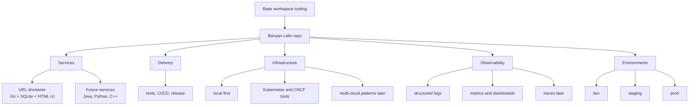

# Banyan Labs Vision

Banyan Labs is a hands-on infrastructure and platform engineering lab.

The premise is simple: a strong infrastructure engineer, platform engineer, or
SRE needs breadth across many tools and depth in how those tools interact.
Certifications are useful, but they often stop at shallow familiarity. Banyan
Labs is meant to create deeper fluency by building a realistic environment that
uses the same kinds of ingredients a medium-sized engineering organization
would need.

## Purpose

Banyan Labs should become a place to practice and demonstrate:

- service development in multiple languages
- local developer workflows
- automated tests and CI/CD
- infrastructure as code
- Kubernetes and CNCF tools
- observability with logs, metrics, dashboards, traces, and alerts
- environment modeling for dev, staging, and production
- multi-cloud infrastructure patterns using existing open source tools
- operational thinking around ownership, scale, reliability, and change

The goal is not to design the final platform up front. The goal is to start
with a small useful service, add complexity deliberately, and let the platform
shape emerge from real needs.

## First Service

The first service is the URL shortener.

Initial decisions:

- language: Go
- module path: `github.com/codeforester/banyanlabs/services/url-shortener`
- location: `services/url-shortener`
- storage: SQLite for local deployment
- UI: minimal HTML UI from day one
- users: authentication and user management are part of the initial scope
- tests: the service must be testable locally and in GitHub Actions

This service should be small enough to build now, but real enough to support
future platform concerns such as configuration, logging, metrics, deployment,
database migrations, CI/CD, and environment promotion.

## Evolution

The first phase is intentionally local:

Base refers to the sibling [Base](https://github.com/codeforester/base#readme)
repository that owns shared workspace tooling.

```text
developer laptop
  -> Base-managed workspace
  -> Banyan Labs repo
  -> Go URL shortener
  -> SQLite
```

Later phases can add:

- more services in Go, Java, Python, and possibly C++
- shared service standards for logging, health checks, metrics, and config
- CI pipelines for test, build, scan, package, and release
- container images
- local Kubernetes
- Terraform and infrastructure modules
- dev, staging, and production environment models
- Prometheus, Grafana, OpenTelemetry, and log aggregation
- Crossplane or similar tools for multi-cloud control-plane patterns

The staged sequence is tracked in the
[Platform Roadmap](platform-roadmap.md).

## Conceptual Architecture



## Cross-Language Logging Direction

Banyan Labs will eventually have services in different languages using
different logging libraries. The uniformity should come from a shared logging
contract, not from forcing every language to use the same library.

Initial logging direction:

- emit structured JSON logs to stdout
- use one event per line
- use UTC timestamps
- include stable fields across services
- include request correlation fields when handling HTTP requests
- keep human-readable local formatting optional, not the default service output

Suggested baseline fields:

| Field | Meaning |
|---|---|
| `timestamp` | UTC event time |
| `level` | `debug`, `info`, `warn`, `error` |
| `service` | service name, such as `url-shortener` |
| `component` | package, subsystem, or handler |
| `message` | concise human-readable event message |
| `trace_id` | distributed trace ID when available |
| `span_id` | span ID when available |
| `request_id` | local request correlation ID |
| `user_id` | authenticated user ID when safe and relevant |
| `method` | HTTP method when relevant |
| `path` | route template or safe request path |
| `status` | HTTP status when relevant |
| `duration_ms` | request or operation duration |
| `error` | sanitized error text when relevant |

For Go, the first service can use the standard library `log/slog` package and
configure JSON output. Java, Python, and future languages can choose idiomatic
libraries, but they should emit the same schema.

This gives Banyan Labs a realistic platform boundary: application teams can use
language-native tools, while the platform defines the operational contract that
logs must satisfy.

## Open Questions

These are intentionally left for discovery:

- Which CNCF tools should appear first after the local service is stable?
- Should local Kubernetes use kind, k3d, minikube, or another tool?
- When should the URL shortener move from SQLite to a network database?
- Which CI/CD system should Banyan Labs standardize on first?
- How much of multi-cloud should be modeled locally before touching real cloud
  accounts?
